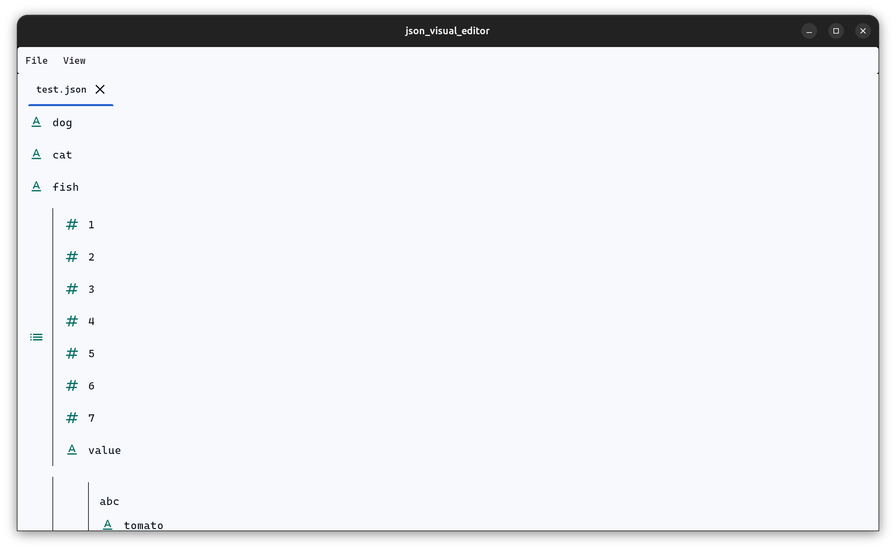
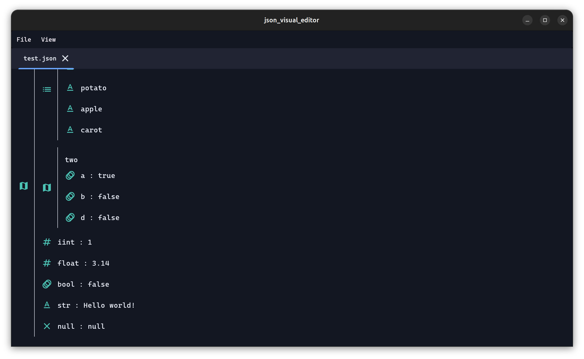

<div align="center">
    <h1>JSON Visual Editor</h1>
    <i>alias JSON VE</i><br>
    is a visual JSON editor made with flutter.
</div>

## Features

### Files
* Open file
* Open recent file
* Save
* Save as
* New file

### Editor
* Add value/list/map at the end of a map/list
* Add value/list/map before/after an element
* Delete element
* Editing key/value

### Global
* Light theme  
  
* Dark theme  
  

## Build / Run
* Windows
  ```bash
  flutter run -d windows # run
  flutter build windows # build
  ```
* MacOS
  ```bash
  flutter run -d macos # run
  flutter build macos # build
  ```
* Linux
  ```bash
  flutter run -d linux # run
  flutter build linux # build
  ```

--- 

> Enjoy editing JSON !
